# snapshot test for testing-realm/scene-0_0/src/tests/camera-position.test.js

```mermaid
sequenceDiagram
  participant runtime
  participant scene
  participant renderer
  participant babylon
  runtime-->>scene: onStart()
  activate scene
  activate renderer
  scene-->>renderer: crdtGetState()
  activate babylon
    babylon-->>renderer: update()
    babylon-->>renderer: lateUpdate()
  deactivate babylon
    renderer-->>scene: PUT c=1 e=0x2 t=1 #v={"position":{"_isDirty":true,"_x":0,"_y":0,"_z":0},"rotation":{"_isDirty":true,"_x":0,"_y":0,"_z":0,"_w":1},"scale":{"_isDirty":true,"_x":1,"_y":1,"_z":1},"parent":0}
    renderer-->>scene: PUT c=1 e=0x1 t=1 #v={"position":{"_isDirty":true,"_x":0,"_y":-1.7000000476837158,"_z":0},"rotation":{"_isDirty":true,"_x":0,"_y":0,"_z":0,"_w":1},"scale":{"_isDirty":true,"_x":1,"_y":1,"_z":1},"parent":0}
    renderer-->>scene: PUT c=1 e=0x5 t=1 #v={"position":{"_isDirty":true,"_x":0,"_y":0,"_z":0},"rotation":{"_isDirty":true,"_x":0,"_y":0,"_z":0,"_w":1},"scale":{"_isDirty":true,"_x":1,"_y":1,"_z":1},"parent":0}
    renderer-->>scene: PUT c=1048 e=0x0 t=1 #v={"frameNumber":0,"totalRuntime":1,"tickNumber":0}
  deactivate renderer
  deactivate scene

  runtime-->>scene: onUpdate(0) frameNumber=0
  activate scene
  loop Frame
  loop Run Systems
  scene-->>scene: engine.update()
  end
  scene->>renderer: crdtSendToRenderer()
  activate renderer
  activate babylon
    babylon-->>renderer: update()
    babylon-->>renderer: lateUpdate()
  deactivate babylon
    renderer-->>scene: PUT c=1 e=0x1 t=2 #v={"position":{"_isDirty":true,"_x":0,"_y":-1.7000000476837158,"_z":0},"rotation":{"_isDirty":true,"_x":0,"_y":0,"_z":0,"_w":1},"scale":{"_isDirty":true,"_x":1,"_y":1,"_z":1},"parent":0}
    renderer-->>scene: PUT c=1 e=0x2 t=2 #v={"position":{"_isDirty":true,"_x":0,"_y":0,"_z":0},"rotation":{"_isDirty":true,"_x":0,"_y":0,"_z":0,"_w":1},"scale":{"_isDirty":true,"_x":1,"_y":1,"_z":1},"parent":0}
    renderer-->>scene: PUT c=1048 e=0x0 t=2 #v={"frameNumber":1,"totalRuntime":1,"tickNumber":1}
  deactivate renderer
  end
  deactivate scene

  runtime-->>scene: onUpdate(0.5) frameNumber=1
  activate scene
  loop Frame
  loop Run Systems
  scene-->>scene: engine.update()
  Note right of scene: "🧪 Running test sanity: test camera position is updated"
  Note right of scene: "⏱️ yield promise"
   # [setCameraTransform]{"position":{"x":1,"y":1,"z":1},"rotation":{"x":0.08682408928871155,"y":0.08682408928871155,"z":-0.007596123497933149,"w":0.9924038648605347}}
  end
  scene->>renderer: crdtSendToRenderer()
  activate renderer
  activate babylon
    babylon-->>renderer: update()
    babylon-->>renderer: lateUpdate()
  deactivate babylon
    renderer-->>scene: PUT c=1 e=0x1 t=3 #v={"position":{"_isDirty":true,"_x":1,"_y":-0.699999988079071,"_z":1},"rotation":{"_isDirty":true,"_x":0,"_y":0,"_z":0,"_w":1},"scale":{"_isDirty":true,"_x":1,"_y":1,"_z":1},"parent":0}
    renderer-->>scene: PUT c=1 e=0x2 t=3 #v={"position":{"_isDirty":true,"_x":1,"_y":1,"_z":1},"rotation":{"_isDirty":true,"_x":0.08682409673929214,"_y":0.08682409673929214,"_z":-0.007596122566610575,"_w":0.9924038648605347},"scale":{"_isDirty":true,"_x":1,"_y":1,"_z":1},"parent":0}
    renderer-->>scene: PUT c=1048 e=0x0 t=3 #v={"frameNumber":2,"totalRuntime":1,"tickNumber":2}
  deactivate renderer
  end
  deactivate scene

  runtime-->>scene: onUpdate(0.5) frameNumber=2
  activate scene
  loop Frame
  loop Run Systems
  scene-->>scene: engine.update()
  Note right of scene: "⏱️ yield"
  end
  scene->>renderer: crdtSendToRenderer()
  activate renderer
  activate babylon
    babylon-->>renderer: update()
    babylon-->>renderer: lateUpdate()
  deactivate babylon
    renderer-->>scene: PUT c=1 e=0x1 t=4 #v={"position":{"_isDirty":true,"_x":1,"_y":-0.699999988079071,"_z":1},"rotation":{"_isDirty":true,"_x":0,"_y":0,"_z":0,"_w":1},"scale":{"_isDirty":true,"_x":1,"_y":1,"_z":1},"parent":0}
    renderer-->>scene: PUT c=1 e=0x2 t=4 #v={"position":{"_isDirty":true,"_x":1,"_y":1,"_z":1},"rotation":{"_isDirty":true,"_x":0.08682409673929214,"_y":0.08682409673929214,"_z":-0.007596122566610575,"_w":0.9924038648605347},"scale":{"_isDirty":true,"_x":1,"_y":1,"_z":1},"parent":0}
    renderer-->>scene: PUT c=1048 e=0x0 t=4 #v={"frameNumber":3,"totalRuntime":1,"tickNumber":3}
  deactivate renderer
  end
  deactivate scene

  runtime-->>scene: onUpdate(0.5) frameNumber=3
  activate scene
  loop Frame
  loop Run Systems
  scene-->>scene: engine.update()
  Note right of scene: "🟢 Test passed sanity: test camera position is updated"
  # [TEST RESULT]{"name":"sanity: test camera position is updated","ok":true,"totalFrames":2,"totalTime":1}
  end
  scene->>renderer: crdtSendToRenderer()
  activate renderer
  activate babylon
    babylon-->>renderer: update()
    babylon-->>renderer: lateUpdate()
  deactivate babylon
    renderer-->>scene: PUT c=1 e=0x1 t=5 #v={"position":{"_isDirty":true,"_x":1,"_y":-0.699999988079071,"_z":1},"rotation":{"_isDirty":true,"_x":0,"_y":0,"_z":0,"_w":1},"scale":{"_isDirty":true,"_x":1,"_y":1,"_z":1},"parent":0}
    renderer-->>scene: PUT c=1 e=0x2 t=5 #v={"position":{"_isDirty":true,"_x":1,"_y":1,"_z":1},"rotation":{"_isDirty":true,"_x":0.08682409673929214,"_y":0.08682409673929214,"_z":-0.007596122566610575,"_w":0.9924038648605347},"scale":{"_isDirty":true,"_x":1,"_y":1,"_z":1},"parent":0}
    renderer-->>scene: PUT c=1048 e=0x0 t=5 #v={"frameNumber":4,"totalRuntime":1,"tickNumber":4}
  deactivate renderer
  end
  deactivate scene
```


The file that produced this snapshot was:
```typescript
import { test } from "@dcl/sdk/testing";
import { Quaternion, Vector3 } from "@dcl/sdk/math";
export * from '@dcl/sdk'

test("sanity: test camera position is updated", function* (_) {
  yield _.setCameraTransform({
    position: Vector3.One(),
    rotation: Quaternion.fromEulerDegrees(10, 10, 0),
  })
})

```