# snapshot test for testing-realm/scene-0_0/src/tests/raycast.test.js

```mermaid
sequenceDiagram
  participant runtime
  participant scene
  participant renderer
  participant babylon
  runtime-->>scene: onStart()
  activate scene
  activate renderer
  scene-->>renderer: crdtGetState()
  activate babylon
    babylon-->>renderer: update()
    babylon-->>renderer: lateUpdate()
  deactivate babylon
    renderer-->>scene: PUT c=1 e=0x2 t=1 #v={"position":{"_isDirty":true,"_x":0,"_y":0,"_z":0},"rotation":{"_isDirty":true,"_x":0,"_y":0,"_z":0,"_w":1},"scale":{"_isDirty":true,"_x":1,"_y":1,"_z":1},"parent":0}
    renderer-->>scene: PUT c=1 e=0x1 t=1 #v={"position":{"_isDirty":true,"_x":0,"_y":0,"_z":0},"rotation":{"_isDirty":true,"_x":0,"_y":0,"_z":0,"_w":1},"scale":{"_isDirty":true,"_x":1,"_y":1,"_z":1},"parent":0}
    renderer-->>scene: PUT c=1 e=0x5 t=1 #v={"position":{"_isDirty":true,"_x":0,"_y":0,"_z":0},"rotation":{"_isDirty":true,"_x":0,"_y":0,"_z":0,"_w":1},"scale":{"_isDirty":true,"_x":1,"_y":1,"_z":1},"parent":0}
    renderer-->>scene: PUT c=1048 e=0x0 t=1 #v={"frameNumber":0,"totalRuntime":1,"tickNumber":0}
  deactivate renderer
  deactivate scene

  runtime-->>scene: onUpdate(0) frameNumber=0
  activate scene
  loop Frame
  loop Run Systems
  scene-->>scene: engine.update()
  end
  scene->>renderer: crdtSendToRenderer()
  activate renderer
  activate babylon
    babylon-->>renderer: update()
    babylon-->>renderer: lateUpdate()
  deactivate babylon
    renderer-->>scene: PUT c=1 e=0x1 t=2 #v={"position":{"_isDirty":true,"_x":0,"_y":0,"_z":0},"rotation":{"_isDirty":true,"_x":0,"_y":0,"_z":0,"_w":1},"scale":{"_isDirty":true,"_x":1,"_y":1,"_z":1},"parent":0}
    renderer-->>scene: PUT c=1 e=0x2 t=2 #v={"position":{"_isDirty":true,"_x":0,"_y":0,"_z":0},"rotation":{"_isDirty":true,"_x":0,"_y":0,"_z":0,"_w":1},"scale":{"_isDirty":true,"_x":1,"_y":1,"_z":1},"parent":0}
    renderer-->>scene: PUT c=1048 e=0x0 t=2 #v={"frameNumber":1,"totalRuntime":1,"tickNumber":1}
  deactivate renderer
  end
  deactivate scene

  runtime-->>scene: onUpdate(0.5) frameNumber=1
  activate scene
  loop Frame
  loop Run Systems
  scene-->>scene: engine.update()
  Note right of scene: "🧪 Running test raycast: raycasting from an entity to global origin yields correct direction"
  Note right of scene: "⏱️ yield"
  end
  scene->>renderer: crdtSendToRenderer()
  activate renderer
    scene-->>renderer: PUT c=1 e=0x200 t=1 #v={"position":{"_isDirty":true,"_x":1,"_y":1,"_z":1},"rotation":{"_isDirty":true,"_x":0,"_y":0,"_z":0,"_w":1},"scale":{"_isDirty":true,"_x":1,"_y":1,"_z":1},"parent":0}
    scene-->>renderer: PUT c=1067 e=0x200 t=1 #v={"timestamp":3,"originOffset":{"x":0,"y":0,"z":0},"direction":{"$case":"globalTarget","globalTarget":{"x":0,"y":10,"z":0}},"maxDistance":10,"queryType":0,"continuous":false}
  activate babylon
    babylon-->>renderer: update()
    babylon-->>renderer: lateUpdate()
  deactivate babylon
    renderer-->>scene: PUT c=1 e=0x1 t=3 #v={"position":{"_isDirty":true,"_x":0,"_y":0,"_z":0},"rotation":{"_isDirty":true,"_x":0,"_y":0,"_z":0,"_w":1},"scale":{"_isDirty":true,"_x":1,"_y":1,"_z":1},"parent":0}
    renderer-->>scene: PUT c=1 e=0x2 t=3 #v={"position":{"_isDirty":true,"_x":0,"_y":0,"_z":0},"rotation":{"_isDirty":true,"_x":0,"_y":0,"_z":0,"_w":1},"scale":{"_isDirty":true,"_x":1,"_y":1,"_z":1},"parent":0}
    renderer-->>scene: PUT c=1048 e=0x0 t=3 #v={"frameNumber":2,"totalRuntime":1,"tickNumber":2}
    renderer-->>scene: PUT c=1068 e=0x200 t=1 #v={"timestamp":3,"globalOrigin":{"x":1,"y":1,"z":1},"direction":{"x":-0.10976426303386688,"y":0.9878783226013184,"z":-0.10976426303386688},"hits":[],"tickNumber":2}
  deactivate renderer
  end
  deactivate scene

  runtime-->>scene: onUpdate(0.5) frameNumber=2
  activate scene
  loop Frame
  loop Run Systems
  scene-->>scene: engine.update()
  Note right of scene: "🟢 Test passed raycast: raycasting from an entity to global origin yields correct direction"
  # [TEST RESULT]{"name":"raycast: raycasting from an entity to global origin yields correct direction","ok":true,"totalFrames":1,"totalTime":0.5}
  end
  scene->>renderer: crdtSendToRenderer()
  activate renderer
  activate babylon
    babylon-->>renderer: update()
    babylon-->>renderer: lateUpdate()
  deactivate babylon
    renderer-->>scene: PUT c=1 e=0x1 t=4 #v={"position":{"_isDirty":true,"_x":0,"_y":0,"_z":0},"rotation":{"_isDirty":true,"_x":0,"_y":0,"_z":0,"_w":1},"scale":{"_isDirty":true,"_x":1,"_y":1,"_z":1},"parent":0}
    renderer-->>scene: PUT c=1 e=0x2 t=4 #v={"position":{"_isDirty":true,"_x":0,"_y":0,"_z":0},"rotation":{"_isDirty":true,"_x":0,"_y":0,"_z":0,"_w":1},"scale":{"_isDirty":true,"_x":1,"_y":1,"_z":1},"parent":0}
    renderer-->>scene: PUT c=1048 e=0x0 t=4 #v={"frameNumber":3,"totalRuntime":1,"tickNumber":3}
  deactivate renderer
  end
  deactivate scene

  runtime-->>scene: onUpdate(0.5) frameNumber=3
  activate scene
  loop Frame
  loop Run Systems
  scene-->>scene: engine.update()
  Note right of scene: "🧪 Running test raycast: raycasting from an entity to local direction origin yields correct direction without transform"
  Note right of scene: "⏱️ yield"
  end
  scene->>renderer: crdtSendToRenderer()
  activate renderer
    scene-->>renderer: PUT c=1 e=0x201 t=1 #v={"position":{"_isDirty":true,"_x":0,"_y":10,"_z":0},"rotation":{"_isDirty":true,"_x":0,"_y":0,"_z":0,"_w":1},"scale":{"_isDirty":true,"_x":1,"_y":1,"_z":1},"parent":0}
    scene-->>renderer: PUT c=1067 e=0x201 t=1 #v={"timestamp":4,"originOffset":{"x":0,"y":0,"z":0},"direction":{"$case":"localDirection","localDirection":{"x":0,"y":-1,"z":0}},"maxDistance":10,"queryType":0,"continuous":false}
  activate babylon
    babylon-->>renderer: update()
    babylon-->>renderer: lateUpdate()
  deactivate babylon
    renderer-->>scene: PUT c=1 e=0x1 t=5 #v={"position":{"_isDirty":true,"_x":0,"_y":0,"_z":0},"rotation":{"_isDirty":true,"_x":0,"_y":0,"_z":0,"_w":1},"scale":{"_isDirty":true,"_x":1,"_y":1,"_z":1},"parent":0}
    renderer-->>scene: PUT c=1 e=0x2 t=5 #v={"position":{"_isDirty":true,"_x":0,"_y":0,"_z":0},"rotation":{"_isDirty":true,"_x":0,"_y":0,"_z":0,"_w":1},"scale":{"_isDirty":true,"_x":1,"_y":1,"_z":1},"parent":0}
    renderer-->>scene: PUT c=1048 e=0x0 t=5 #v={"frameNumber":4,"totalRuntime":1,"tickNumber":4}
    renderer-->>scene: PUT c=1068 e=0x201 t=1 #v={"timestamp":4,"globalOrigin":{"x":0,"y":10,"z":0},"direction":{"x":0,"y":-1,"z":0},"hits":[],"tickNumber":4}
  deactivate renderer
  end
  deactivate scene

  runtime-->>scene: onUpdate(0.5) frameNumber=4
  activate scene
  loop Frame
  loop Run Systems
  scene-->>scene: engine.update()
  Note right of scene: "🟢 Test passed raycast: raycasting from an entity to local direction origin yields correct direction without transform"
  # [TEST RESULT]{"name":"raycast: raycasting from an entity to local direction origin yields correct direction without transform","ok":true,"totalFrames":1,"totalTime":0.5}
  end
  scene->>renderer: crdtSendToRenderer()
  activate renderer
  activate babylon
    babylon-->>renderer: update()
    babylon-->>renderer: lateUpdate()
  deactivate babylon
    renderer-->>scene: PUT c=1 e=0x1 t=6 #v={"position":{"_isDirty":true,"_x":0,"_y":0,"_z":0},"rotation":{"_isDirty":true,"_x":0,"_y":0,"_z":0,"_w":1},"scale":{"_isDirty":true,"_x":1,"_y":1,"_z":1},"parent":0}
    renderer-->>scene: PUT c=1 e=0x2 t=6 #v={"position":{"_isDirty":true,"_x":0,"_y":0,"_z":0},"rotation":{"_isDirty":true,"_x":0,"_y":0,"_z":0,"_w":1},"scale":{"_isDirty":true,"_x":1,"_y":1,"_z":1},"parent":0}
    renderer-->>scene: PUT c=1048 e=0x0 t=6 #v={"frameNumber":5,"totalRuntime":1,"tickNumber":5}
  deactivate renderer
  end
  deactivate scene

  runtime-->>scene: onUpdate(0.5) frameNumber=5
  activate scene
  loop Frame
  loop Run Systems
  scene-->>scene: engine.update()
  Note right of scene: "🧪 Running test raycast: raycasting from an entity to another entity works like globalTarget"
  Note right of scene: "⏱️ yield"
  end
  scene->>renderer: crdtSendToRenderer()
  activate renderer
    scene-->>renderer: PUT c=1 e=0x202 t=1 #v={"position":{"_isDirty":true,"_x":0,"_y":10,"_z":0},"rotation":{"_isDirty":true,"_x":0,"_y":0,"_z":0,"_w":1},"scale":{"_isDirty":true,"_x":1,"_y":1,"_z":1},"parent":0}
    scene-->>renderer: PUT c=1 e=0x203 t=1 #v={"position":{"_isDirty":true,"_x":0,"_y":10,"_z":10},"rotation":{"_isDirty":true,"_x":0,"_y":0,"_z":0,"_w":1},"scale":{"_isDirty":true,"_x":1,"_y":1,"_z":1},"parent":0}
    scene-->>renderer: PUT c=1067 e=0x202 t=1 #v={"timestamp":5,"originOffset":{"x":0,"y":0,"z":0},"direction":{"$case":"targetEntity","targetEntity":515},"maxDistance":100,"queryType":0,"continuous":false}
  activate babylon
    babylon-->>renderer: update()
    babylon-->>renderer: lateUpdate()
  deactivate babylon
    renderer-->>scene: PUT c=1 e=0x1 t=7 #v={"position":{"_isDirty":true,"_x":0,"_y":0,"_z":0},"rotation":{"_isDirty":true,"_x":0,"_y":0,"_z":0,"_w":1},"scale":{"_isDirty":true,"_x":1,"_y":1,"_z":1},"parent":0}
    renderer-->>scene: PUT c=1 e=0x2 t=7 #v={"position":{"_isDirty":true,"_x":0,"_y":0,"_z":0},"rotation":{"_isDirty":true,"_x":0,"_y":0,"_z":0,"_w":1},"scale":{"_isDirty":true,"_x":1,"_y":1,"_z":1},"parent":0}
    renderer-->>scene: PUT c=1048 e=0x0 t=7 #v={"frameNumber":6,"totalRuntime":1,"tickNumber":6}
    renderer-->>scene: PUT c=1068 e=0x202 t=1 #v={"timestamp":5,"globalOrigin":{"x":0,"y":10,"z":0},"direction":{"x":0,"y":0,"z":1},"hits":[],"tickNumber":6}
  deactivate renderer
  end
  deactivate scene

  runtime-->>scene: onUpdate(0.5) frameNumber=6
  activate scene
  loop Frame
  loop Run Systems
  scene-->>scene: engine.update()
  Note right of scene: "🟢 Test passed raycast: raycasting from an entity to another entity works like globalTarget"
  # [TEST RESULT]{"name":"raycast: raycasting from an entity to another entity works like globalTarget","ok":true,"totalFrames":1,"totalTime":0.5}
  end
  scene->>renderer: crdtSendToRenderer()
  activate renderer
  activate babylon
    babylon-->>renderer: update()
    babylon-->>renderer: lateUpdate()
  deactivate babylon
    renderer-->>scene: PUT c=1 e=0x1 t=8 #v={"position":{"_isDirty":true,"_x":0,"_y":0,"_z":0},"rotation":{"_isDirty":true,"_x":0,"_y":0,"_z":0,"_w":1},"scale":{"_isDirty":true,"_x":1,"_y":1,"_z":1},"parent":0}
    renderer-->>scene: PUT c=1 e=0x2 t=8 #v={"position":{"_isDirty":true,"_x":0,"_y":0,"_z":0},"rotation":{"_isDirty":true,"_x":0,"_y":0,"_z":0,"_w":1},"scale":{"_isDirty":true,"_x":1,"_y":1,"_z":1},"parent":0}
    renderer-->>scene: PUT c=1048 e=0x0 t=8 #v={"frameNumber":7,"totalRuntime":1,"tickNumber":7}
  deactivate renderer
  end
  deactivate scene

  runtime-->>scene: onUpdate(0.5) frameNumber=7
  activate scene
  loop Frame
  loop Run Systems
  scene-->>scene: engine.update()
  Note right of scene: "🧪 Running test raycast: raycasting from an entity to local direction origin yields correct direction with last entity rotated"
  Note right of scene: "⏱️ yield"
  end
  scene->>renderer: crdtSendToRenderer()
  activate renderer
    scene-->>renderer: PUT c=1 e=0x204 t=1 #v={"position":{"_isDirty":true,"_x":0,"_y":10,"_z":0},"rotation":{"_isDirty":true,"_x":0.4619397521018982,"_y":0.19134171307086945,"_z":0.19134171307086945,"_w":0.8446232080459595},"scale":{"_isDirty":true,"_x":1,"_y":1,"_z":1},"parent":0}
    scene-->>renderer: PUT c=1067 e=0x204 t=1 #v={"timestamp":6,"originOffset":{"x":0,"y":0,"z":0},"direction":{"$case":"globalDirection","globalDirection":{"x":0,"y":-1,"z":0}},"maxDistance":10,"queryType":0,"continuous":false}
  activate babylon
    babylon-->>renderer: update()
    babylon-->>renderer: lateUpdate()
  deactivate babylon
    renderer-->>scene: PUT c=1 e=0x1 t=9 #v={"position":{"_isDirty":true,"_x":0,"_y":0,"_z":0},"rotation":{"_isDirty":true,"_x":0,"_y":0,"_z":0,"_w":1},"scale":{"_isDirty":true,"_x":1,"_y":1,"_z":1},"parent":0}
    renderer-->>scene: PUT c=1 e=0x2 t=9 #v={"position":{"_isDirty":true,"_x":0,"_y":0,"_z":0},"rotation":{"_isDirty":true,"_x":0,"_y":0,"_z":0,"_w":1},"scale":{"_isDirty":true,"_x":1,"_y":1,"_z":1},"parent":0}
    renderer-->>scene: PUT c=1048 e=0x0 t=9 #v={"frameNumber":8,"totalRuntime":1,"tickNumber":8}
    renderer-->>scene: PUT c=1068 e=0x204 t=1 #v={"timestamp":6,"globalOrigin":{"x":0,"y":10,"z":0},"direction":{"x":0,"y":-1,"z":0},"hits":[],"tickNumber":8}
  deactivate renderer
  end
  deactivate scene

  runtime-->>scene: onUpdate(0.5) frameNumber=8
  activate scene
  loop Frame
  loop Run Systems
  scene-->>scene: engine.update()
  Note right of scene: "🟢 Test passed raycast: raycasting from an entity to local direction origin yields correct direction with last entity rotated"
  # [TEST RESULT]{"name":"raycast: raycasting from an entity to local direction origin yields correct direction with last entity rotated","ok":true,"totalFrames":1,"totalTime":0.5}
  end
  scene->>renderer: crdtSendToRenderer()
  activate renderer
  activate babylon
    babylon-->>renderer: update()
    babylon-->>renderer: lateUpdate()
  deactivate babylon
    renderer-->>scene: PUT c=1 e=0x1 t=10 #v={"position":{"_isDirty":true,"_x":0,"_y":0,"_z":0},"rotation":{"_isDirty":true,"_x":0,"_y":0,"_z":0,"_w":1},"scale":{"_isDirty":true,"_x":1,"_y":1,"_z":1},"parent":0}
    renderer-->>scene: PUT c=1 e=0x2 t=10 #v={"position":{"_isDirty":true,"_x":0,"_y":0,"_z":0},"rotation":{"_isDirty":true,"_x":0,"_y":0,"_z":0,"_w":1},"scale":{"_isDirty":true,"_x":1,"_y":1,"_z":1},"parent":0}
    renderer-->>scene: PUT c=1048 e=0x0 t=10 #v={"frameNumber":9,"totalRuntime":1,"tickNumber":9}
  deactivate renderer
  end
  deactivate scene
```


The file that produced this snapshot was:
```typescript
import { engine, EngineInfo, Raycast, RaycastQueryType, RaycastResult, Transform } from '@dcl/sdk/ecs'
import { Quaternion, Vector3 } from '@dcl/sdk/math'
import { test } from '@dcl/sdk/testing'
import { assertComponentValue } from '@dcl/sdk/testing/assert'
export * from '@dcl/sdk'

test("raycast: raycasting from an entity to global origin yields correct direction", function* (context) {
  const globalTarget = Vector3.create(0, 10, 0)
  const globalOrigin = Vector3.One()

  // 1. Create an entity with a transform component and a raycast component
  const entity = engine.addEntity()

  Transform.create(entity, { position: globalOrigin })
  Raycast.create(entity, {
    originOffset: Vector3.Zero(),
    direction: { $case: 'globalTarget', globalTarget },
    continuous: false,
    maxDistance: 10,
    queryType: RaycastQueryType.RQT_HIT_FIRST,
    timestamp: 3
  })

  // 2. Wait for the next frame to let the RaycastSystem to process the raycast
  yield // wait for next frame

  // 3. Validate that the RaycastResult component of the entity has the correct direction
  assertComponentValue(entity, RaycastResult, {
    direction: Vector3.normalize(Vector3.subtract(globalTarget, globalOrigin)),
    globalOrigin,
    hits: [],
    timestamp: 3,
    tickNumber: EngineInfo.get(engine.RootEntity).tickNumber
  })
})

test("raycast: raycasting from an entity to local direction origin yields correct direction without transform", function* (context) {
  // create a new entity with a transform and a raycast component
  const globalOrigin = Vector3.create(0, 10, 0)
  const localDirection = Vector3.Down()

  const entity = engine.addEntity()

  Transform.create(entity, { position: globalOrigin })
  Raycast.create(entity, {
    originOffset: Vector3.Zero(),
    direction: { $case: 'localDirection', localDirection },
    continuous: false,
    maxDistance: 10,
    queryType: RaycastQueryType.RQT_HIT_FIRST,
    timestamp: 4
  })

  // wait for the next frame
  yield

  // check that the raycast result component was added to the entity
  assertComponentValue(entity, RaycastResult, {
    direction: Vector3.normalize(Vector3.Down()),
    globalOrigin,
    hits: [],
    timestamp: 4,
    tickNumber: EngineInfo.get(engine.RootEntity).tickNumber
  })
})

test("raycast: raycasting from an entity to another entity works like globalTarget", function* (context) {
  // create a new entity with a transform and a raycast component
  const globalOrigin = Vector3.create(0, 10, 0)
  const targetEntityGlobalOrigin = Vector3.create(0, 10, 10)

  const entity = engine.addEntity()
  const targetEntity = engine.addEntity()

  Transform.create(entity, { position: globalOrigin })
  Transform.create(targetEntity, { position: targetEntityGlobalOrigin })

  Raycast.create(entity, {
    originOffset: Vector3.Zero(),
    direction: { $case: 'targetEntity', targetEntity },
    continuous: false,
    maxDistance: 100,
    queryType: RaycastQueryType.RQT_HIT_FIRST,
    timestamp: 5
  })

  // wait for the next frame
  yield

  // check that the raycast result component was added to the entity
  assertComponentValue(entity, RaycastResult, {
    direction: Vector3.normalize(Vector3.subtract(targetEntityGlobalOrigin, globalOrigin)),
    globalOrigin,
    hits: [],
    timestamp: 5,
    tickNumber: EngineInfo.get(engine.RootEntity).tickNumber
  })
})

test("raycast: raycasting from an entity to local direction origin yields correct direction with last entity rotated", function* (context) {
  // create a new entity with a transform and a raycast component
  const globalOrigin = Vector3.create(0, 10, 0)
  const globalDirection = Vector3.Down()

  const entity = engine.addEntity()

  Transform.create(entity, { position: globalOrigin, rotation: Quaternion.fromEulerDegrees(45, 45, 45) })
  Raycast.create(entity, {
    originOffset: Vector3.Zero(),
    direction: { $case: 'globalDirection', globalDirection },
    continuous: false,
    maxDistance: 10,
    queryType: RaycastQueryType.RQT_HIT_FIRST,
    timestamp: 6
  })

  // wait for the next frame
  yield

  // check that the raycast result component was added to the entity
  assertComponentValue(entity, RaycastResult, {
    direction: Vector3.normalize(Vector3.Down()),
    globalOrigin,
    hits: [],
    timestamp: 6,
    tickNumber: EngineInfo.get(engine.RootEntity).tickNumber
  })
})
```