# snapshot test for testing-realm/scene-0_0/src/tests/testing-framework.test.js

```mermaid
sequenceDiagram
  participant runtime
  participant scene
  participant renderer
  participant babylon
  runtime-->>scene: onStart()
  activate scene
  activate renderer
  scene-->>renderer: crdtGetState()
  activate babylon
    babylon-->>renderer: update()
    babylon-->>renderer: lateUpdate()
  deactivate babylon
    renderer-->>scene: PUT c=1 e=0x2 t=1 #v={"position":{"_isDirty":true,"_x":0,"_y":0,"_z":0},"rotation":{"_isDirty":true,"_x":0,"_y":0,"_z":0,"_w":1},"scale":{"_isDirty":true,"_x":1,"_y":1,"_z":1},"parent":0}
    renderer-->>scene: PUT c=1 e=0x1 t=1 #v={"position":{"_isDirty":true,"_x":0,"_y":-1.600000023841858,"_z":0},"rotation":{"_isDirty":true,"_x":0,"_y":0,"_z":0,"_w":1},"scale":{"_isDirty":true,"_x":1,"_y":1,"_z":1},"parent":0}
    renderer-->>scene: PUT c=1048 e=0x0 t=1 #v={"frameNumber":0,"totalRuntime":1,"tickNumber":0}
  deactivate renderer
  deactivate scene

  runtime-->>scene: onUpdate(0) frameNumber=0
  activate scene
  loop Frame
  loop Run Systems
  scene-->>scene: engine.update()
  end
  scene->>renderer: crdtSendToRenderer()
  activate renderer
  activate babylon
    babylon-->>renderer: update()
    babylon-->>renderer: lateUpdate()
  deactivate babylon
    renderer-->>scene: PUT c=1 e=0x1 t=2 #v={"position":{"_isDirty":true,"_x":0,"_y":-1.600000023841858,"_z":0},"rotation":{"_isDirty":true,"_x":0,"_y":0,"_z":0,"_w":1},"scale":{"_isDirty":true,"_x":1,"_y":1,"_z":1},"parent":0}
    renderer-->>scene: PUT c=1 e=0x2 t=2 #v={"position":{"_isDirty":true,"_x":0,"_y":0,"_z":0},"rotation":{"_isDirty":true,"_x":0,"_y":0,"_z":0,"_w":1},"scale":{"_isDirty":true,"_x":1,"_y":1,"_z":1},"parent":0}
    renderer-->>scene: PUT c=1048 e=0x0 t=2 #v={"frameNumber":1,"totalRuntime":1,"tickNumber":1}
  deactivate renderer
  end
  deactivate scene

  runtime-->>scene: onUpdate(0.5) frameNumber=1
  activate scene
  loop Frame
  loop Run Systems
  scene-->>scene: engine.update()
  Note right of scene: "🧪 Running test testing framework: yield works"
  Note right of scene: "⏱️ yield"
  end
  scene->>renderer: crdtSendToRenderer()
  activate renderer
  activate babylon
    babylon-->>renderer: update()
    babylon-->>renderer: lateUpdate()
  deactivate babylon
    renderer-->>scene: PUT c=1 e=0x1 t=3 #v={"position":{"_isDirty":true,"_x":0,"_y":-1.600000023841858,"_z":0},"rotation":{"_isDirty":true,"_x":0,"_y":0,"_z":0,"_w":1},"scale":{"_isDirty":true,"_x":1,"_y":1,"_z":1},"parent":0}
    renderer-->>scene: PUT c=1 e=0x2 t=3 #v={"position":{"_isDirty":true,"_x":0,"_y":0,"_z":0},"rotation":{"_isDirty":true,"_x":0,"_y":0,"_z":0,"_w":1},"scale":{"_isDirty":true,"_x":1,"_y":1,"_z":1},"parent":0}
    renderer-->>scene: PUT c=1048 e=0x0 t=3 #v={"frameNumber":2,"totalRuntime":1,"tickNumber":2}
  deactivate renderer
  end
  deactivate scene

  runtime-->>scene: onUpdate(0.5) frameNumber=2
  activate scene
  loop Frame
  loop Run Systems
  scene-->>scene: engine.update()
  Note right of scene: "⏱️ yield promise"
  end
  scene->>renderer: crdtSendToRenderer()
  activate renderer
  activate babylon
    babylon-->>renderer: update()
    babylon-->>renderer: lateUpdate()
  deactivate babylon
    renderer-->>scene: PUT c=1 e=0x1 t=4 #v={"position":{"_isDirty":true,"_x":0,"_y":-1.600000023841858,"_z":0},"rotation":{"_isDirty":true,"_x":0,"_y":0,"_z":0,"_w":1},"scale":{"_isDirty":true,"_x":1,"_y":1,"_z":1},"parent":0}
    renderer-->>scene: PUT c=1 e=0x2 t=4 #v={"position":{"_isDirty":true,"_x":0,"_y":0,"_z":0},"rotation":{"_isDirty":true,"_x":0,"_y":0,"_z":0,"_w":1},"scale":{"_isDirty":true,"_x":1,"_y":1,"_z":1},"parent":0}
    renderer-->>scene: PUT c=1048 e=0x0 t=4 #v={"frameNumber":3,"totalRuntime":1,"tickNumber":3}
  deactivate renderer
  end
  deactivate scene

  runtime-->>scene: onUpdate(0.5) frameNumber=3
  activate scene
  loop Frame
  loop Run Systems
  scene-->>scene: engine.update()
  Note right of scene: "⏱️ yield"
  end
  scene->>renderer: crdtSendToRenderer()
  activate renderer
  activate babylon
    babylon-->>renderer: update()
    babylon-->>renderer: lateUpdate()
  deactivate babylon
    renderer-->>scene: PUT c=1 e=0x1 t=5 #v={"position":{"_isDirty":true,"_x":0,"_y":-1.600000023841858,"_z":0},"rotation":{"_isDirty":true,"_x":0,"_y":0,"_z":0,"_w":1},"scale":{"_isDirty":true,"_x":1,"_y":1,"_z":1},"parent":0}
    renderer-->>scene: PUT c=1 e=0x2 t=5 #v={"position":{"_isDirty":true,"_x":0,"_y":0,"_z":0},"rotation":{"_isDirty":true,"_x":0,"_y":0,"_z":0,"_w":1},"scale":{"_isDirty":true,"_x":1,"_y":1,"_z":1},"parent":0}
    renderer-->>scene: PUT c=1048 e=0x0 t=5 #v={"frameNumber":4,"totalRuntime":1,"tickNumber":4}
  deactivate renderer
  end
  deactivate scene

  runtime-->>scene: onUpdate(0.5) frameNumber=4
  activate scene
  loop Frame
  loop Run Systems
  scene-->>scene: engine.update()
  Note right of scene: "⏱️ yield function"
  end
  scene->>renderer: crdtSendToRenderer()
  activate renderer
  activate babylon
    babylon-->>renderer: update()
    babylon-->>renderer: lateUpdate()
  deactivate babylon
    renderer-->>scene: PUT c=1 e=0x1 t=6 #v={"position":{"_isDirty":true,"_x":0,"_y":-1.600000023841858,"_z":0},"rotation":{"_isDirty":true,"_x":0,"_y":0,"_z":0,"_w":1},"scale":{"_isDirty":true,"_x":1,"_y":1,"_z":1},"parent":0}
    renderer-->>scene: PUT c=1 e=0x2 t=6 #v={"position":{"_isDirty":true,"_x":0,"_y":0,"_z":0},"rotation":{"_isDirty":true,"_x":0,"_y":0,"_z":0,"_w":1},"scale":{"_isDirty":true,"_x":1,"_y":1,"_z":1},"parent":0}
    renderer-->>scene: PUT c=1048 e=0x0 t=6 #v={"frameNumber":5,"totalRuntime":1,"tickNumber":5}
  deactivate renderer
  end
  deactivate scene

  runtime-->>scene: onUpdate(0.5) frameNumber=5
  activate scene
  loop Frame
  loop Run Systems
  scene-->>scene: engine.update()
  Note right of scene: "⏱️ yield"
  end
  scene->>renderer: crdtSendToRenderer()
  activate renderer
  activate babylon
    babylon-->>renderer: update()
    babylon-->>renderer: lateUpdate()
  deactivate babylon
    renderer-->>scene: PUT c=1 e=0x1 t=7 #v={"position":{"_isDirty":true,"_x":0,"_y":-1.600000023841858,"_z":0},"rotation":{"_isDirty":true,"_x":0,"_y":0,"_z":0,"_w":1},"scale":{"_isDirty":true,"_x":1,"_y":1,"_z":1},"parent":0}
    renderer-->>scene: PUT c=1 e=0x2 t=7 #v={"position":{"_isDirty":true,"_x":0,"_y":0,"_z":0},"rotation":{"_isDirty":true,"_x":0,"_y":0,"_z":0,"_w":1},"scale":{"_isDirty":true,"_x":1,"_y":1,"_z":1},"parent":0}
    renderer-->>scene: PUT c=1048 e=0x0 t=7 #v={"frameNumber":6,"totalRuntime":1,"tickNumber":6}
  deactivate renderer
  end
  deactivate scene

  runtime-->>scene: onUpdate(0.5) frameNumber=6
  activate scene
  loop Frame
  loop Run Systems
  scene-->>scene: engine.update()
  Note right of scene: "⏱️ yield function"
  end
  scene->>renderer: crdtSendToRenderer()
  activate renderer
  activate babylon
    babylon-->>renderer: update()
    babylon-->>renderer: lateUpdate()
  deactivate babylon
    renderer-->>scene: PUT c=1 e=0x1 t=8 #v={"position":{"_isDirty":true,"_x":0,"_y":-1.600000023841858,"_z":0},"rotation":{"_isDirty":true,"_x":0,"_y":0,"_z":0,"_w":1},"scale":{"_isDirty":true,"_x":1,"_y":1,"_z":1},"parent":0}
    renderer-->>scene: PUT c=1 e=0x2 t=8 #v={"position":{"_isDirty":true,"_x":0,"_y":0,"_z":0},"rotation":{"_isDirty":true,"_x":0,"_y":0,"_z":0,"_w":1},"scale":{"_isDirty":true,"_x":1,"_y":1,"_z":1},"parent":0}
    renderer-->>scene: PUT c=1048 e=0x0 t=8 #v={"frameNumber":7,"totalRuntime":1,"tickNumber":7}
  deactivate renderer
  end
  deactivate scene

  runtime-->>scene: onUpdate(0.5) frameNumber=7
  activate scene
  loop Frame
  loop Run Systems
  scene-->>scene: engine.update()
  Note right of scene: "⏱️ yield promise"
  end
  scene->>renderer: crdtSendToRenderer()
  activate renderer
  activate babylon
    babylon-->>renderer: update()
    babylon-->>renderer: lateUpdate()
  deactivate babylon
    renderer-->>scene: PUT c=1 e=0x1 t=9 #v={"position":{"_isDirty":true,"_x":0,"_y":-1.600000023841858,"_z":0},"rotation":{"_isDirty":true,"_x":0,"_y":0,"_z":0,"_w":1},"scale":{"_isDirty":true,"_x":1,"_y":1,"_z":1},"parent":0}
    renderer-->>scene: PUT c=1 e=0x2 t=9 #v={"position":{"_isDirty":true,"_x":0,"_y":0,"_z":0},"rotation":{"_isDirty":true,"_x":0,"_y":0,"_z":0,"_w":1},"scale":{"_isDirty":true,"_x":1,"_y":1,"_z":1},"parent":0}
    renderer-->>scene: PUT c=1048 e=0x0 t=9 #v={"frameNumber":8,"totalRuntime":1,"tickNumber":8}
  deactivate renderer
  end
  deactivate scene

  runtime-->>scene: onUpdate(0.5) frameNumber=8
  activate scene
  loop Frame
  loop Run Systems
  scene-->>scene: engine.update()
  Note right of scene: "⏱️ yield"
  end
  scene->>renderer: crdtSendToRenderer()
  activate renderer
  activate babylon
    babylon-->>renderer: update()
    babylon-->>renderer: lateUpdate()
  deactivate babylon
    renderer-->>scene: PUT c=1 e=0x1 t=10 #v={"position":{"_isDirty":true,"_x":0,"_y":-1.600000023841858,"_z":0},"rotation":{"_isDirty":true,"_x":0,"_y":0,"_z":0,"_w":1},"scale":{"_isDirty":true,"_x":1,"_y":1,"_z":1},"parent":0}
    renderer-->>scene: PUT c=1 e=0x2 t=10 #v={"position":{"_isDirty":true,"_x":0,"_y":0,"_z":0},"rotation":{"_isDirty":true,"_x":0,"_y":0,"_z":0,"_w":1},"scale":{"_isDirty":true,"_x":1,"_y":1,"_z":1},"parent":0}
    renderer-->>scene: PUT c=1048 e=0x0 t=10 #v={"frameNumber":9,"totalRuntime":1,"tickNumber":9}
  deactivate renderer
  end
  deactivate scene

  runtime-->>scene: onUpdate(0.5) frameNumber=9
  activate scene
  loop Frame
  loop Run Systems
  scene-->>scene: engine.update()
  Note right of scene: "🟢 Test passed testing framework: yield works"
  # [TEST RESULT]{"name":"testing framework: yield works","ok":true,"totalFrames":8,"totalTime":4}
  end
  scene->>renderer: crdtSendToRenderer()
  activate renderer
  activate babylon
    babylon-->>renderer: update()
    babylon-->>renderer: lateUpdate()
  deactivate babylon
    renderer-->>scene: PUT c=1 e=0x1 t=11 #v={"position":{"_isDirty":true,"_x":0,"_y":-1.600000023841858,"_z":0},"rotation":{"_isDirty":true,"_x":0,"_y":0,"_z":0,"_w":1},"scale":{"_isDirty":true,"_x":1,"_y":1,"_z":1},"parent":0}
    renderer-->>scene: PUT c=1 e=0x2 t=11 #v={"position":{"_isDirty":true,"_x":0,"_y":0,"_z":0},"rotation":{"_isDirty":true,"_x":0,"_y":0,"_z":0,"_w":1},"scale":{"_isDirty":true,"_x":1,"_y":1,"_z":1},"parent":0}
    renderer-->>scene: PUT c=1048 e=0x0 t=11 #v={"frameNumber":10,"totalRuntime":1,"tickNumber":10}
  deactivate renderer
  end
  deactivate scene

  runtime-->>scene: onUpdate(0.5) frameNumber=10
  activate scene
  loop Frame
  loop Run Systems
  scene-->>scene: engine.update()
  Note right of scene: "🧪 Running test testing framework: ensure previous test's yield are resolved"
  Note right of scene: "🟢 Test passed testing framework: ensure previous test's yield are resolved"
  # [TEST RESULT]{"name":"testing framework: ensure previous test's yield are resolved","ok":true,"totalFrames":0,"totalTime":0}
  end
  scene->>renderer: crdtSendToRenderer()
  activate renderer
  activate babylon
    babylon-->>renderer: update()
    babylon-->>renderer: lateUpdate()
  deactivate babylon
    renderer-->>scene: PUT c=1 e=0x1 t=12 #v={"position":{"_isDirty":true,"_x":0,"_y":-1.600000023841858,"_z":0},"rotation":{"_isDirty":true,"_x":0,"_y":0,"_z":0,"_w":1},"scale":{"_isDirty":true,"_x":1,"_y":1,"_z":1},"parent":0}
    renderer-->>scene: PUT c=1 e=0x2 t=12 #v={"position":{"_isDirty":true,"_x":0,"_y":0,"_z":0},"rotation":{"_isDirty":true,"_x":0,"_y":0,"_z":0,"_w":1},"scale":{"_isDirty":true,"_x":1,"_y":1,"_z":1},"parent":0}
    renderer-->>scene: PUT c=1048 e=0x0 t=12 #v={"frameNumber":11,"totalRuntime":1,"tickNumber":11}
  deactivate renderer
  end
  deactivate scene
```


The file that produced this snapshot was:
```typescript
import { engine } from "@dcl/sdk/ecs";
import { assertEquals } from "@dcl/sdk/testing/assert";
import { test } from "@dcl/sdk/testing";
export * from '@dcl/sdk'

// this system counts the amount of times it was executed
let renderCount = 1;
engine.addSystem(() => { renderCount++ }, Infinity);

let tickCount = 0;
test("testing framework: yield works", function* () {
  renderCount = 0

  assertEquals(tickCount++, renderCount)
  yield
  assertEquals(tickCount++, renderCount)
  yield Promise.resolve()
  tickCount++ // 1 is added to the tickCount because the promise delays the execution of the next yield
  assertEquals(tickCount++, renderCount) 
  yield () => { }
  tickCount++ // 1 is added to the tickCount because the function call delays the continuation of the test by one tick
  assertEquals(tickCount++, renderCount) 
  yield async () => { }
  tickCount++ // 1 is added to the tickCount because the promise delays the execution of the next yield
  tickCount++ // 1 is added to the tickCount because the function call delays the continuation of the test by one tick
  assertEquals(tickCount++, renderCount) 
});

test("testing framework: ensure previous test's yield are resolved", function* () {
  assertEquals(tickCount, 9)
});
```